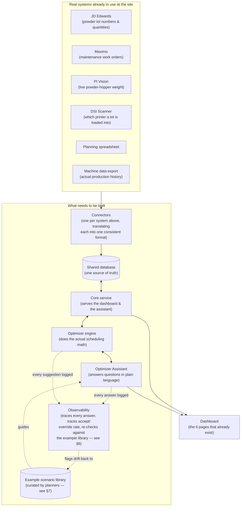

# Realta 3D Printing Schedule Optimizer — Target System Design

**Status: proposal.** This describes what turning today's dashboard prototype into a real, data-connected system would involve — where the data would actually come from, how it would be stored and connected, and how the "Optimizer Assistant" would go from a demo chat box to something that actually reasons over live production data. Nothing described here is built yet. This document is meant to be readable by both engineering and non-engineering stakeholders — it explains what each piece does and why, without assuming a technical background.

Read alongside `ARCHITECTURE.md`, which documents what exists *today*: a dashboard with six working pages, but no real backend and no real data behind it — every number on screen is invented (though invented carefully, to match the real rules of the process). The good news is that building the prototype already answered the hardest question — *what should this look like and how should it behave* — through many rounds of review against real spreadsheets and stakeholder feedback. What's described below is how to make it real.

---

## 1. What's already proven, and what's missing

The prototype already got right:

- **The page designs and workflows** — six pages covering production tracking, powder cycle tracking, batch/lot comparison, operator scheduling, powder planning, and an hourly live schedule — all reviewed and refined against how the site actually works.
- **The business rules** — how the powder cycle works (a printer starts with 70kg, tops up three times, then gets a full change, over 120 builds), when a quality-check ("IPM") build is required, why builds can't start too close to the end of a shift, and the real maintenance cadence. These rules are already correctly captured; the real system needs to run them against real data instead of made-up data.

What's missing is everything underneath: nothing is connected to a real data source, there's no shared database, and the "Optimizer Assistant" chat box today just matches keywords to a canned answer — it doesn't actually look at anything.

---

## 2. The big picture

Five parts, each independent of the others:

1. **The real systems** — tools the site already uses, currently disconnected from each other and from the dashboard.
2. **Connectors** — one small piece of software per real system, whose only job is translation (see §4).
3. **The shared database and core service** — one place all the dashboard's data lives and is served from, replacing every "made-up" number in the prototype with a real one.
4. **The Optimizer Engine and Assistant** — new capability the prototype doesn't have at all: something that actually calculates recommendations and can explain them in plain language.
5. **The example library and observability** — new, added directly in response to a gap flagged when this design was first reviewed: *how do we actually know the assistant's answers are any good?* (§7 and §8 below).

---

## 3. Real data sources this would connect to

| Source | What it provides | How today's dashboard fakes it | How it would connect | How often it updates | Where things stand |
|---|---|---|---|---|---|
| JD Edwards | Powder lot numbers, quantity on hand | Invented lot codes and quantities | Scheduled data pull | Daily, plus on delivery | Site has access; not yet connected |
| Maximo | Planned maintenance dates & windows | A fixed, made-up maintenance calendar | Scheduled data pull | Every 30 minutes or so | No dashboard access yet |
| PI Vision | Live powder-hopper weight per printer | A simulated weight curve | Live/frequent check-in | Near real-time | Reference data exists; not yet connected |
| DSI Scanner | Which printer a powder lot is physically in | Assumed, not tracked | Instant update on each scan | Real-time | Hardware exists; not yet feeding any system |
| Planning spreadsheet | The planned build schedule | A simplified, made-up plan | Either watch the spreadsheet for changes, or move planning into this system directly | Whenever it's updated | Needs a conversation about how detailed the real sheet actually is |
| Machine data export | Real build/changeover history | One sample file was used to shape the mock data | Direct connection if the machines support it, otherwise scheduled exports | As often as possible | Only a one-time sample so far |
| Shift roster | Who's working which shift, and leave | Made-up names and time off | Not yet determined | Not yet determined | **No system identified yet — open question** |

**The key idea behind the connectors**: each real system gets its own small "translator," so the rest of the system never has to know or care about that system's particular quirks. If JD Edwards changes how it reports data next year, only its one translator needs updating — the database, the dashboard, and the assistant are all unaffected. It also means a source that isn't ready yet (the shift roster, the DSI scanner) can be filled in with a reasonable placeholder without blocking everything else from being built.

---

## 4. The shared database

Think of this as a set of structured, linked spreadsheets that replace the various disconnected Excel files and personal trackers in use today. Everything the dashboard shows, and everything the optimizer reasons about, is read from here.

- **Printers** — one row per real printer (14 total, not the split 3-and-20 the prototype uses today). Tracks whether it's running, idle, or decommissioned; which shift pattern it's on; and its current position in the powder cycle.
- **Powder deliveries and lots** — a "delivery" is the full 610kg that arrives at once; it's automatically split into four "lots," one portion per printer (~150kg each). Each lot tracks how much powder is left, whether it's passed its quality check yet, and when it was last sampled (samples are a real compliance requirement — a missed one caused a formal corrective action last year).
- **Storage** — the cabinets holding powder that isn't currently loaded into a printer. This directly addresses a named pain point today: powder sitting in a cabinet with no visible owner, because assignment only lives in one person's spreadsheet.
- **Scheduled events** — every build, changeover, powder top-up, quality-check build, and maintenance window lives in one shared table, tagged with which printer it belongs to and which "view" of the schedule it's part of (the real production history, the plan, the forecast, or the live hour-by-hour view). Keeping this in one place — rather than a separate table per event type — is what guarantees the different dashboard pages can never disagree about how long a build actually took.
- **Maintenance** — linked to Maximo's real target dates and the actual window this system proposes for the work.
- **Operators and leave** — the real roster and time-off schedule, once a source system is identified.
- **Recommendations** — new, and not present in the prototype at all: every time the system suggests something (a build size, a maintenance slot, a powder warning), that suggestion is recorded along with whether a person accepted or overrode it. This is both an audit trail ("why did the system suggest that?") and the core data behind observability (§8) — an override is exactly the kind of signal that tells us something's off.
- **Example scenario library** — also new: a curated, reviewable set of worked examples ("given this situation, here's what a good recommendation looks like, and why") that the assistant is shown alongside every question it's asked, and that its answers get periodically checked against. See §7 for why this exists and who maintains it.

---

## 5. The core service

Everything above is served to the dashboard, and to the assistant, through one central service — organized by topic (printers, powder, schedules, recommendations, chat), mirroring the six pages that already exist. Unlike the prototype, this service would actually check who's allowed to see or change what, since it's now handling real production data rather than a public demo.

Some data (JD Edwards, Maximo, the planning sheet) is naturally checked on a schedule, since it doesn't change minute-to-minute. Other data (the DSI scanner, and possibly the live powder-weight feed) should update immediately when something happens, rather than waiting for the next scheduled check — a lot being scanned into a printer should update the dashboard right away, not the next morning.

---

## 6. The Optimizer Agent

This is the capability the prototype only pretends to have. It needs to actually solve four real, already-named problems:

1. **Powder risk tracking** — flag printers approaching a powder change, make sure a quality-check build happens before any new lot's first use, and don't let the required sample-per-topup step get missed.
2. **Build recommendations** — suggest what an operator should run next on a given printer, so that printers finish in a staggered way across a shift rather than several needing attention at the exact same moment.
3. **Maintenance scheduling** — suggest a good time slot for a printer's upcoming maintenance, without clashing with any other printer's maintenance (there's usually only one technician available).
4. **Answering questions in plain language** — "what should I run next on DE1352?", "when's a good time for maintenance?" — answered by actually checking the current data, not a fixed script.

### Two parts, kept deliberately separate

- **A calculation engine** that does the actual scheduling math. This part is plain, predictable logic — the same kind of rule-following the prototype's mock data already does correctly, just running against real data instead of invented data.
- **A conversational layer** — an AI assistant that understands a question asked in ordinary language, figures out which calculation is relevant, asks the calculation engine for the answer, and replies in plain language.

**Why split it this way**: scheduling decisions need to be reliably correct — a maintenance suggestion that secretly clashes with another printer's maintenance is worse than no suggestion at all. That kind of correctness comes from ordinary, testable logic, not from an AI model "guessing" at a good answer. But *understanding a question typed in plain English* is exactly what an AI language model is good at. So the AI's role is to understand what's being asked and fetch the right calculation — never to do the scheduling math itself.

### What the calculation engine actually does, in plain terms

- **Recommend the next build**: for a given printer, look at how much time is left in the current shift, see when the same operator's other printers are due to finish, and suggest a build length that spreads finish times apart — so the operator isn't suddenly free from three printers at once, and no printer sits idle waiting for attention.
- **Suggest a maintenance window**: for a given printer, find a gap between scheduled builds that's long enough for the maintenance work, check that no other printer already has maintenance booked in that same window, and propose the earliest option that actually works.
- **Flag powder risk**: for every printer, work out how many days remain before its next powder change is due, and flag anything urgent — including whether a quality sample is due, and whether the next lot lined up for it will need a fresh quality-check build.

### What the conversational layer does

An operator or planner can just ask, in their own words — for example, "What should DE1352 run next, and is it due for maintenance soon?" The assistant works out which of the calculations above are relevant, gets the actual numbers, and replies clearly — always pointing to the real figures behind its answer rather than a vague suggestion. Here's roughly what that exchange would look like:

> **Operator:** What should DE1352 run next, and is it due for maintenance soon?
>
> **Assistant:** DE1352 just finished Build 9 and is idle. I'd recommend a 9.5-hour build next — it finishes around 14:30, staggered about 40 minutes from Grainne's other two printers, so she isn't freeing up from all three at once. On powder, it's 41.5 days out from its next full change, so no urgency there. Nothing's due for maintenance in the next two weeks.

### Guardrails

- **It recommends — it never quietly changes the schedule on its own.** A person always has to accept or override a suggestion before it becomes part of the real plan.
- **Every suggestion is logged**, along with what the person actually decided — so there's always a clear record of what was recommended, when, and why, and this record is what lets the recommendations be improved over time.
- **If it's missing information or working from stale data, it says so** rather than answering anyway.

---

## 7. Teaching the assistant what "good" looks like

This section exists because of a specific, fair challenge raised when this design was first reviewed: *the assistant needs direction — we can't just point it at the data and hope it figures out how we actually make these calls.*

Here's the important distinction: a traditional machine-learning model gets *trained* on examples — it changes permanently based on what it's shown. A language-model-based assistant like this one is different — it isn't retrained on our data. Instead, every time it's asked something, it can be shown a set of reference examples *alongside* the question, so its answer follows the same pattern as those examples. It doesn't remember them afterward — they have to be supplied every time — but as long as they are, the assistant's behavior is anchored to real, approved examples instead of guessing at what we'd want.

So concretely, this means building a small, curated **library of worked examples** — one set for each of the three things the calculation engine does (§6):

- *Build recommendations*: "given a printer in this state, with these other printers finishing around this time, here's the recommended build size, and here's the reasoning."
- *Maintenance scheduling*: "given this maintenance due date and this technician calendar, here's the slot we'd pick, and why the alternatives were rejected."
- *Powder risk*: "given these days-remaining and sample-status numbers, here's what should be flagged as urgent versus routine."

**Who writes these**: a planner or senior operator — not an engineer. The entire point is capturing how the people who already make these calls actually think about them, including the judgment calls that aren't written down anywhere (why one option is preferred over an equally "valid" one). Engineering's job is to make these examples easy to add, review, and update — not to write them.

**Where this lives**: as its own reviewable library inside the shared database (§4), not buried inside a prompt or a piece of code somewhere. That matters for two reasons: a non-engineer needs to be able to review and update it as the real process changes, without needing a code change; and — just as important — the same examples used to guide the assistant's behavior double as the check for whether it's still behaving the way it's supposed to. Which is exactly the next section.

---

## 8. Observability — knowing whether it's actually working

The other half of the same challenge: even with good examples guiding it, how do we actually know the assistant's suggestions are good, or trace back *why* it said what it said? Right now, nothing in this design would let anyone check that — and it needs to be built in from the start, not bolted on later. Three concrete pieces:

1. **A full trace of every answer.** Every time the assistant is asked something, record what was asked, which calculations it consulted, what those calculations returned, and what it ultimately said. If a suggestion turns out wrong, this is what lets someone reconstruct exactly why — instead of just "the AI said so," with no way to check.
2. **Tracking real-world outcomes, not just answers.** The recommendation log (§4) — every suggestion, and whether a person accepted or overrode it — is the main signal here. A suggestion that keeps getting overridden is a sign something's off, and that pattern needs to be visible, not buried in a table nobody looks at. Over time, this is also how we'd tell whether the assistant is actually getting more useful, or just being tolerated.
3. **Regularly re-testing against the example library.** The worked examples from §7 aren't only for guiding behavior — they're also a checklist. Any time the assistant's instructions change, or on a regular schedule, re-run those same scenarios and confirm it still gives the expected kind of answer. This is how drift gets caught early, rather than discovered by a frustrated operator on the floor.

None of this is visible on the operator-facing dashboard day to day — it's a separate, internal view, for whoever owns the assistant (engineering, plus a planner), showing: recent questions and answers, how often suggestions are accepted versus overridden, and whether it's still passing its example checklist.

---

## 9. How this would run, in practice

At a high level: one service handles all the data and the assistant's answers, one shared database holds everything described in §4, and a background process periodically checks the outside systems (JD Edwards, Maximo, and so on) to keep that database current. The dashboard (the six pages that already exist) talks only to this service — it never talks to JD Edwards, Maximo, or any other outside system directly.

---

## 10. Open questions for stakeholders

- What system (if any) holds the real operator shift roster and leave? Not yet identified.
- Does the real planning spreadsheet break plans down by lot and build size, or only show totals? This affects how much detail the Timeline and Live Schedule pages can honestly show once connected.
- Where does the maintenance technician's own calendar/availability live — inside Maximo, or somewhere else?
- How quickly does a powder-risk warning need to reach someone — is checking every few minutes enough, or does it need to be closer to instant?
- Who actually signs off on an Optimizer Assistant suggestion in practice — is it always the shift operator, or does it depend on the type of suggestion (a build-size suggestion vs. a maintenance-scheduling one)?
- Who owns writing and maintaining the example scenario library (§7) day to day — a specific planner, a rotating group, whoever's closest to the process at the time? This needs an owner, or the library goes stale the same way the current personal Excel tracker's knowledge is stuck with one person.
- How often should the example checklist (§8) be re-run — only when something changes, or on a fixed schedule regardless?

---

## 11. Suggested order of work

1. **Already done** — the dashboard prototype, validated against made-up data.
2. **Foundation** — build the shared database and core service, moving to the real 14-printer roster, replaying the one real sample of historical data through it before any live connections exist.
3. **Connect real sources one at a time** — starting with JD Edwards and Maximo (already accessible, just not connected), then PI Vision and the DSI scanner (likely need coordination with plant IT/engineering), then the shift roster once a source system is identified.
4. **Build the calculation engine** against real data, and show its suggestions as plain dashboard alerts first — so planners can check they're actually correct before anyone relies on the chat assistant for them.
5. **Build the first version of the example library (§7) alongside it** — a handful of real, agreed-on scenarios per calculation, written with a planner, before the assistant answers a single real question.
6. **Add the conversational assistant** on top, once the calculations and the example library are both in place — with observability (§8) turned on from day one, not added after something goes wrong.
7. **Roll out gradually** alongside the current manual, spreadsheet-based process — running both in parallel for a while, using the recommendation log and the observability view to build confidence before retiring the old way of working.
